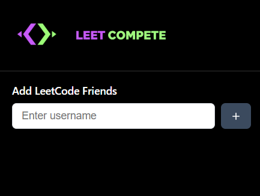
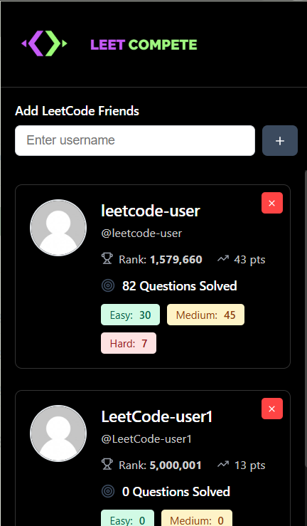

# Leet Compete

A Chrome extension to track and compare LeetCode statistics with your friends. Add multiple users and view their coding progress in a beautiful, dark-themed interface.

## Features

- 🎯 Add multiple LeetCode users to track
- 📊 View real-time statistics including:
  - Global ranking
  - Contest points
  - Total problems solved
  - Difficulty breakdown (Easy, Medium, Hard)
- 💾 Persistent storage - your friend list saves automatically
- 🎨 Dark theme interface
- 📜 Scrollable user list
- ❌ Easy removal of users

## Installation

1. **Download or Clone this repository**
   ```bash
   git clone https://github.com/sanskruti645/LEET-COMPETE.git
   ```

2. **Open Chrome and navigate to Extensions**
   - Type `chrome://extensions/` in your address bar
   - Or click the three dots menu → Extensions → Manage Extensions

3. **Enable Developer Mode**
   - Toggle the "Developer mode" switch in the top-right corner

4. **Load the Extension**
   - Click the "Load unpacked" button
   - Navigate to the project folder and select the `public` directory
   - Click "Select Folder"

5. **Pin the Extension (Optional)**
   - Click the puzzle icon in the Chrome toolbar
   - Find "Leet Compete" and click the pin icon

## Usage

1. **Add a Friend**
   - Click the extension icon in your Chrome toolbar
   - Enter a LeetCode username in the input field
   - Click the + button or press Enter
   - The user's stats will appear below

2. **View Multiple Friends**
   - Keep adding usernames to build your friend list
   - Scroll through the list to view all users
   - All added users are saved automatically

3. **Remove a Friend**
   - Click the red X button in the top-right corner of any user card

## Screenshots:

**The extension displays:**
   - User avatar and name
   - Global ranking
   - Contest points
   - Total questions solved
   - Breakdown by difficulty level
    
    
   

## Technical Details

- Built with vanilla JavaScript, HTML, and CSS
- Uses LeetCode's GraphQL API
- Chrome Storage API for data persistence
- Manifest V3 compliant

## Permissions

- `storage` - To save your friend list locally
- `host_permissions` - To fetch data from leetcode.com

## Development

The project structure:
```
leetfriends/
├── public/
│   ├── manifest.json    # Extension configuration
│   ├── popup.html       # Extension popup UI
│   ├── popup.css        # Styling
│   └── popup.js         # Main functionality
└── main.js              # Standalone API test script
```

## Requirements

- Google Chrome (or Chromium-based browser)
- Active internet connection to fetch LeetCode data

## Troubleshooting

**Extension not loading?**
- Make sure you selected the `public` folder, not the root folder
- Check that all files are present in the `public` directory

**User stats not showing?**
- Verify the username is correct (case-sensitive)
- Check your internet connection
- Ensure the user has a public LeetCode profile

**Stats not updating?**
- Remove and re-add the user to fetch fresh data
- Reload the extension from chrome://extensions/

## License

MIT License - Feel free to use and modify as needed.

## Contributing

Contributions are welcome! Feel free to open issues or submit pull requests.

## Author

Created for competitive programmers who want to track their progress alongside friends.
